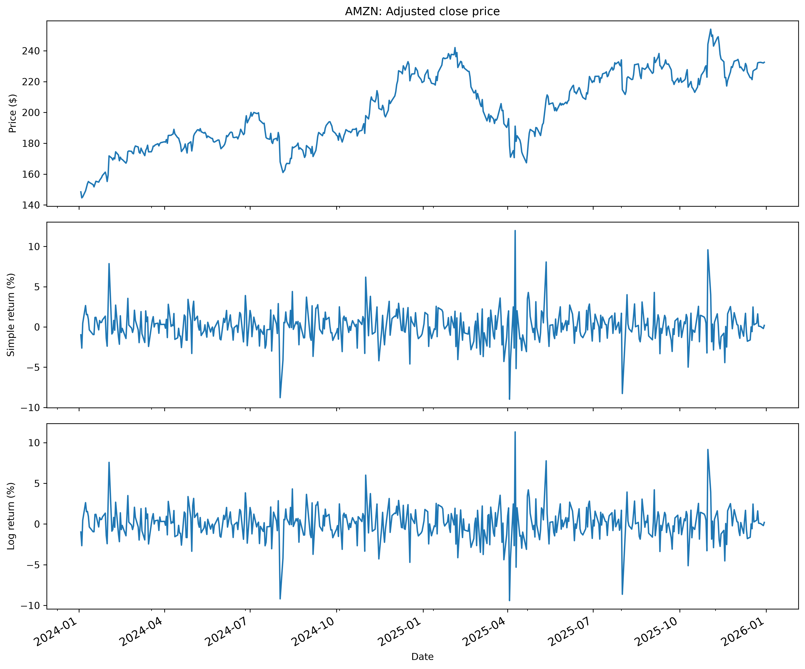
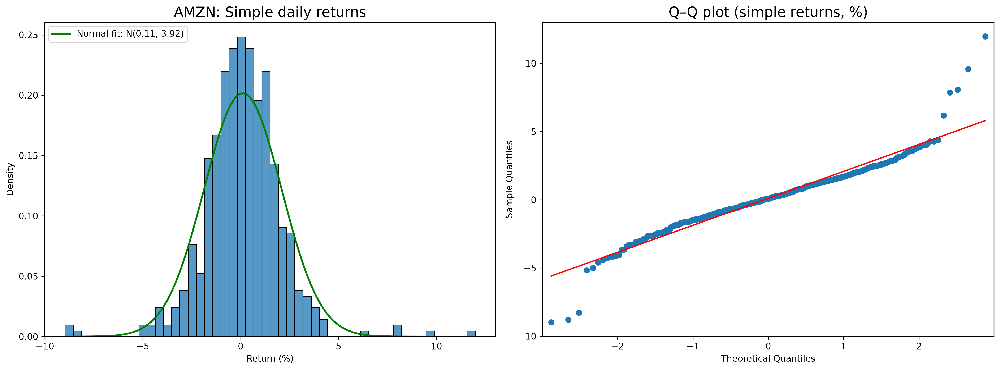
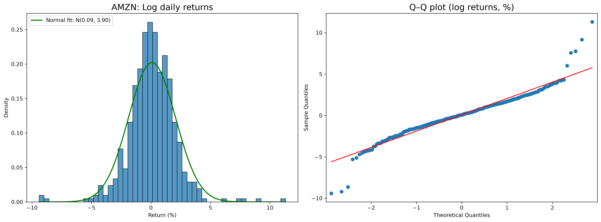

# Amazon Stock Return Analysis

Statistical analysis of Amazon (AMZN) stock returns using Python to examine return behavior, distribution characteristics, normality, and tail risk.

## Project Overview

This project analyzes historical Amazon stock price data and evaluates the statistical properties of daily simple and log returns. The analysis focuses on whether observed stock returns are consistent with a theoretical normal distribution and explores the implications of deviations from normality for financial risk analysis.

## Analysis

- Calculated daily simple and log returns from historical AMZN price data
- Computed descriptive statistics including mean, median, standard deviation, skewness, and excess kurtosis
- Visualized empirical return distributions using histograms and Kernel Density Estimation (KDE)
- Fitted theoretical normal distributions to observed returns
- Used Q-Q plots to evaluate deviations from normality
- Applied the Jarque-Bera test to statistically assess normality
- Evaluated tail behavior and the implications of non-normal returns for financial risk

## Key Findings

AMZN daily returns are centered close to zero but exhibit substantially heavier tails than a theoretical normal distribution.

The return distributions show high excess kurtosis, while Q-Q plots reveal noticeable deviations from normality in the tails. Jarque-Bera tests also reject the normality assumption for both simple and log returns.

These results suggest that modeling stock returns using only a normal distribution may understate the probability of extreme price movements and therefore underestimate tail risk.

## Visualizations

### Price and Return Time Series

The time-series plots compare AMZN's adjusted closing price with daily simple and log returns, highlighting periods of elevated return volatility.

### Simple Return Distribution

The empirical distribution exhibits heavier tails than the fitted normal distribution, with Q-Q plot deviations becoming more pronounced at the extremes.

### Log Return Distribution

Log returns show similar non-normal tail behavior, reinforcing the limitations of the normality assumption for modeling extreme return movements.

## Tools & Technologies

- Python
- Pandas
- NumPy
- SciPy
- Matplotlib
- Statsmodels
- Jupyter Notebook

## Files

- `amazon_stock_return_analysis.ipynb` — Full Jupyter Notebook with code, visualizations, and analysis
- `amazon_stock_return_analysis.py` — Python script version of the analysis

## Skills Demonstrated

Financial Data Analysis · Statistical Analysis · Python · Data Visualization · Return Distribution Analysis · Normality Testing · Quantitative Risk Analysis
